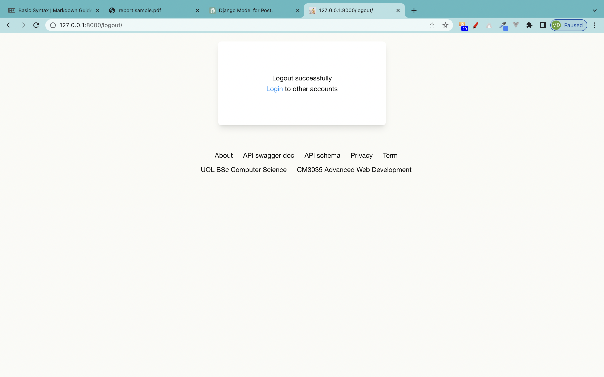
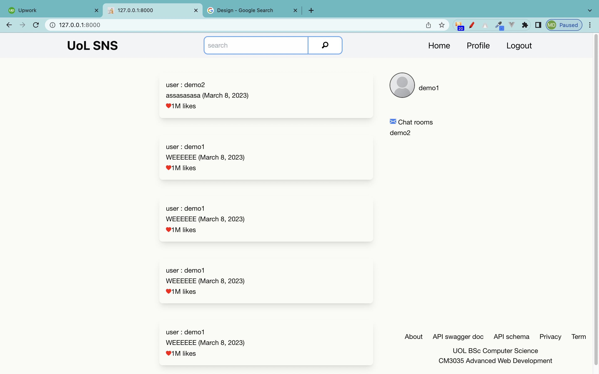

### Part I

---

# Meeting the Requirements

In order to meet all the requirements when building this application, a few
different techniques, strategies and concepts were put to good use. Firstly,
all Django views are class-based and rely on Django REST Framework to
reduce the boilerplate needed to write the views [1; 2]. One such (simple)
view is shown below:

### User Account Database Model Class source Code Below

```python
class AppUser(models.Model):
    user = models.OneToOneField(User, on_delete=models CASCADE,related_name="profile")
    profileImage = models.ImageField(upload_to='images_profile', null=True, blank=True)
    dateOfBirth = models.DateField(null=True, blank=True)
    ocupation = models.CharField(max_length=60, null=True, blank=True)
    organization = models.CharField(max_length=100, null=True, blank=True)
    bio = models.CharField(max_length=400, null=True, blank=True)

    def __unicode__(self):
        return self.user.username

```

All views in turn rely on forms to parse incoming data and to transform
it into appropriate structures that can be used internally by Django. Some
forms are obviously more complex than others, but for demonstration
purposes and for the sake of brevity, an example of a class-based serializer is
reproduced here:

### User Account Form With Taillwind Style Css class source code Below

```python
class UserForm(forms.ModelForm):
    username = forms.CharField(widget=forms.TextInput(attrs={'placeholder':'username', 'class':'h-[35px] border-none focus:outline-none focus:border-none ring-1 ring-blue-400 rounded-lg focus:ring-2 focus:ring-blue-500'}), label='')
    password = forms.CharField(widget=forms.PasswordInput(attrs={'placeholder':'password', 'class':'h-[35px] border-none focus:outline-none focus:border-none ring-1 ring-blue-400 rounded-lg focus:ring-2 focus:ring-blue-500'}), label='')
    email = forms.EmailField(widget=forms.TextInput(attrs={'placeholder':'email', 'class':'h-[35px] border-none focus:outline-none focus:border-none ring-1 ring-blue-400 rounded-lg focus:ring-2 focus:ring-blue-500'}), label='')
    firstName = forms.CharField(widget=forms.TextInput(attrs={'placeholder': 'first name', 'class':'h-[35px] border-none focus:outline-none focus:border-none ring-1 ring-blue-400 rounded-lg focus:ring-2 focus:ring-blue-500'}), label='')
    lastName = forms.CharField(widget=forms.TextInput(attrs={'placeholder': 'last name', 'class':'h-[35px] border-none focus:outline-none focus:border-none ring-1 ring-blue-400 rounded-lg focus:ring-2 focus:ring-blue-500'}), label='')

    class Meta:
        model = User
        fields = ('username', 'password', 'email', 'firstName', 'lastName',)

```

The actual implementation details for signals, forms, URLs, other views and
components can be explored in the source code submission provided with
this report.

### User Account Serializer Source Code Below

```python
class AppUserSerializer(serializers.ModelSerializer):
    class Meta:
        model = AppUser
        fields = ['profileImage', 'dateOfBirth','ocupation', 'organization', 'bio']
```

This is a Django REST Framework serializer for the `AppUser` model, which has the following fields:

> `profileImage`: An image field that stores the user's profile picture.
>
> `dateOfBirth`: A date field that represents the user's date of birth.
>
> `ocupation`: A character field that stores the user's occupation.
>
> `organization`: A character field that stores the user's organization.
>
> `bio`: A character field that stores the user's biography.
>
> The serializer specifies the `AppUser` model as the model to serialize and lists the fields that should be included in the serialized representation. In this case, the serializer includes all the fields of the `AppUser` model, which are `profileImage`, `dateOfBirth`, `ocupation`, `organization`, and `bio`.

### Post Database Model source Code Below

```python
class Post(models.Model):
    postId = models.AutoField(primary_key=True)
    user = models.ForeignKey(
        User, on_delete=models.DO_NOTHING, related_name='posts')
    postDate = models.DateField(null=True)
    text = models.CharField(max_length=500)
    likes = models.IntegerField(null=True)
    media = models.ImageField(upload_to='images_post')
```

> `postId`: An auto-incrementing integer field that serves as the primary key of the model.
>
> `user`: A foreign key that links the post to a User object. If a user is deleted, the post will not be deleted (DO_NOTHING behavior). The related_name argument specifies the name to use for the reverse relation from the User model to the Post model.
>
> `postDate`: A date field that represents the date of the post. It can be null if the date is unknown.
>
> `text`: A character field with a maximum length of 500 that stores the text content of the post.
>
> `likes`: An integer field that represents the number of likes that the post has received. It can be null if the number of likes is unknown.
>
> `media`: An image field that stores the media content of the post. The upload_to argument specifies the directory where uploaded files will be stored.

### Post Database Source Code Below

```python
class NewPostForm(forms.Form):
    text = forms.CharField(required=True, widget=forms.Textarea(attrs={'placeholder':'what you reckon?','class':'h-[35px] border-none focus:outline-none focus:border-none ring-1 ring-blue-400 rounded-lg focus:ring-2 focus:ring-blue-500'}), label='', help_text="word limit : 500")
    media = forms.ImageField(label="image", required=False)
    user = forms.CharField(widget=forms.HiddenInput(), required=False)

    def save(self, user, time):
        text = self.cleaned_data['text']
        media = self.cleaned_data['media']
        post = Post(user=user, postDate=time, text=text,likes=0, media=media,)
        post.save()
```

This is a Django form called NewPostForm that inherits from the forms.Form class. It has the following fields:

> `text`: A required character field that uses a Textarea widget to allow the user to input a longer text content for the post. It also has a placeholder and some custom styling. The help_text attribute provides a hint for the user on the maximum number of words allowed for the text.
>
> `media`: An image field that allows the user to upload an image file for the post. It is not required, so it can be left blank.
>
> `user`: A hidden input field that stores the user ID of the author of the post. It is not required, but it is automatically populated with the user ID when the form is submitted.

The form also has a save method that takes the 'user' object and a `time` parameter, which represents the date and time when the post was created. The method extracts the cleaned data from the form, creates a new `Post` object using the provided data, and saves it to the database using the `save()` method of the `Post` model.

### Post Serializer Source Code Below

```python
class PostSerializer(serializers.ModelSerializer):
    class Meta:
        model = Post
        fields = ['postId', 'user', 'postDate', 'text', 'media', 'likes']
```

This is a Django REST Framework serializer for the `Post` model, which has the following fields:

> `postId`: An auto-incrementing integer field that serves as the primary key of the model.
>
> `user`: A foreign key that links the post to a User object.
>
> `postDate`: A date field that represents the date of the post.
>
> `text`: A character field with a maximum length of 500 that stores the text content of the post.
>
> `media`: An image field that stores the media content of the post.
> likes: An integer field that represents the number of likes that the post has received.

The serializer specifies the `Post` model as the model to serialize and lists the fields that should be included in the serialized representation. In this case, the serializer includes all the fields of the `Post` model, which are `postId`, `user`, `postDate`, `text`, `media`, and `likes`.

### Follower DataBase Model Source Code Below

```python
class Follower(models.Model):
    user = models.CharField(max_length=200)
    follower = models.CharField(max_length=200)
    chat_room = models.CharField(max_length=100, null=True)

```

This is a Django model for a `Follower` object that represents a follower-followee relationship between two users. It has the following fields:

> `user`: A character field with a maximum length of 200 that stores the username of the user who is being followed.
>
> `follower`: A character field with a maximum length of 200 that stores the username of the follower.
>
> `chat_room`: A character field with a maximum length of 100 that stores the name of the chat room associated with the relationship. It can be null if there is no chat room associated with the relationship.

`Note: that this model does not specify any foreign key relationships with other models, so it does not enforce referential integrity. It assumes that the user and follower fields store valid usernames that correspond to existing users in the system.`

### Follower Serializer Source Code Below

```python
class FollowerSerializer(serializers.ModelSerializer):
    class Meta:
        model = Follower
        fields = ['user', 'follower', 'chat_room']

```

his is a Django REST Framework serializer for the `Follower` model, which has the following fields:

> `user`: A character field with a maximum length of 200 that stores the username of the user who is being followed.
>
> `follower`: A character field with a maximum length of 200 that stores the username of the follower.
>
> `chat_room`: A character field with a maximum length of 100 that stores the name of the chat room associated with the relationship. It can be null if there is no chat room associated with the relationship.
>
> The serializer specifies the `Follower` model as the model to serialize and lists the fields that should be included in the serialized representation. In this case, the serializer includes all the fields of the `Follower` model, which are `user`, `follower`, and `chat_room`.

### Message DataBase Model Source Code Below

```python
class ChatMessageModel(models.Model):
    room = models.CharField(max_length=255)
    message = models.TextField(max_length=2000)
    sender = models.CharField(max_length=255)
    create_at = models.DateTimeField(auto_now_add=True)

    class Meta:

        verbose_name = 'Chat Message'
        verbose_name_plural = 'Chat Message'

    def __str__(self):
        return self.room

    @staticmethod
    def getAllMessage(room):
        return ChatMessageModel.objects.filter(
            room=room)

```

This is a Django model for a `ChatMessageModel` object that represents a message sent in a chat room. It has the following fields:

> `room`: A character field with a maximum length of 255 that stores the name of the chat room associated with the message.
>
> `message`: A text field with a maximum length of 2000 that stores the content of the message.
>
> `sender`: A character field with a maximum length of 255 that stores the name of the user who sent the message.
>
> `create_at`: A date-time field that stores the date and time when the message was created. It is set to the current date and time when the message is created.
> The model also has a custom getAllMessage method that returns all the messages in a chat room specified by the room parameter.

The Meta class specifies the verbose names for the model, which are used in the Django admin interface. The **str** method returns the name of the chat room associated with the message when the object is printed or displayed.

### Message Model Serializer Source Code Below

```python
class messagesSerializer(serializers.ModelSerializer):
    class Meta:
        model = ChatMessageModel
        fields = "__all__"

```

This is a Django REST Framework serializer for the `ChatMessageModel` model

### Realtime Message Consumer Class Source Code below

```python

import json
from channels.generic.websocket import AsyncWebsocketConsumer, WebsocketConsumer
from asgiref.sync import async_to_sync
from snsApp.models import ChatMessageModel
from snsApp.serializers import messagesSerializer


class ChatConsumer(WebsocketConsumer):
    def connect(self):  # connect user to websocket
        self.room_name = self.scope['url_route']['kwargs']['room_name']
        self.room_group_name = 'chat_%s' % self.room_name

        # connect to the redis server
        async_to_sync(self.channel_layer.group_add)(
            self.room_group_name,
            self.channel_name
        )

        self.accept()
        # messages get static call action
        self.messagesData = ChatMessageModel.getAllMessage(
            self.room_name)

        # message list group send
        async_to_sync(self.channel_layer.group_send)(self.room_group_name, {
            'type': "chatList.Action",
            'messages': messagesSerializer(self.messagesData, many=True).data
        })

    def disconnect(self, close_code):  # dis-connect from websocket
        # dis connect from the redis server
        async_to_sync(self.channel_layer.group_discard)(
            self.room_group_name,
            self.channel_name
        )

    def receive(self, text_data):  # recieve data from user
        text_data_json = json.loads(text_data)
        message = text_data_json['message']
        username = text_data_json['username']
        # send message to the chat room
        async_to_sync(self.channel_layer.group_send)(
            self.room_group_name,
            {
                'type': 'chat_message',
                'message': message,
                'username': username

            }
        )

    def chatList_Action(self, event):
        self.send(text_data=json.dumps(
            {'action': "list", "data": event['messages']}))

    def chat_message(self, event):

        message = event['message']
        username = event['username']

        self.send(text_data=json.dumps({"action": "add", "data": messagesSerializer(ChatMessageModel.objects.create(
            room=self.room_name, message=message, sender=username,)).data}))


```

This code defines a consumer for a WebSocket connection that handles chat messages between users. The `ChatConsumer` inherits from `WebsocketConsumer` and defines several methods:

> `connect`: This method is called when a client connects to the WebSocket. It retrieves the room name from the URL, adds the WebSocket to the room's channel group, and sends a message to the client indicating that the connection was successful. It also retrieves the list of messages for the room and sends it to the client.
>
> `disconnect`: This method is called when a client disconnects from the WebSocket. It removes the WebSocket from the room's channel group.
>
> `receive`: This method is called when the client sends a message to the WebSocket. It extracts the message and the username from the JSON data and sends the message to the room's channel group.
>
> `chatList_Action`: This method is called when a new WebSocket joins the room. It sends the list of messages for the room to the WebSocket.
>
> `chat_message`: This method is called when a message is received in the room's channel group. It extracts the message and the username from the event data and sends the message to all WebSockets in the room.

---

### Part II

## Application View Seaction

Django views are responsible for handling HTTP requests and returning HTTP responses. When a user makes a request to a Django web application, the request is routed to a view function based on the URL specified in the request. The view function processes the request and returns a response.

### Registe View function Source code Below

```python
def register(request):
    registered = False

    if request.method == 'POST':
        user_form = UserForm(data=request.POST)
        profile_form = UserProfileForm(request.POST, request.FILES)
        if user_form.is_valid() and profile_form.is_valid(): #form validation
            user = user_form.save()
            user.set_password(user.password)
            user.save()
            profile = profile_form.save(commit=False)
            profile.user = user
            profile.save()
            registered=True
    else:
        user_form = UserForm()
        profile_form = UserProfileForm()

    return render(request, 'snsApp/signup.html', {'user_form': user_form, 'profile_form':profile_form, 'registered':registered})


```

### Register UI Desgin


The function first checks the request method, which is expected to be a POST request when the user submits the registration form.

If the request method is POST, the function validates the user form and profile form by calling their respective `is_valid()` methods. If both forms are valid, it saves the user object, sets the password, and saves the profile object. It also sets the `registered` flag to `True`.

If the request method is not POST, the function creates new instances of the user form and profile form objects.

Finally, the function renders the `signup.html` template and passes the user form, profile form, and registered flag as context variables.

### User Login View function source code Below

```python
def user_login(request):
    if request.method == 'POST':
        username = request.POST['username']
        password = request.POST['password']
        user = authenticate(username=username, password=password)
        if user:
            if user.is_active:
                login(request, user)
                return HttpResponseRedirect('/')
            else:
                return HttpResponse("Your account is disable")
        else:
            return HttpResponse("Invalid login")
    return render(request, 'snsApp/login.html', {})

```

### FontEnd UI Desgin


1. The view function checks if the incoming request method is POST or not. If it's not POST, it simply renders the login template and returns it to the user.

2. If the request method is POST, it retrieves the username and password from the request object's POST dictionary.

3. It then calls the `authenticate` function from Django's `contrib.auth` module, passing in the username and password. This function checks if the user exists and the provided password is correct. If the user exists and the password is correct, it returns the user object, otherwise it returns None.

4. If the `authenticate` function returns a user object, the view function checks if the user is active or not. If the user is active, it logs the user in using the login function from `contrib.auth` module and redirects the user to the home page. If the user is not active, it returns an HttpResponse saying that the user account is disabled.

5. If the authenticate function returns None, it returns an HttpResponse saying that the login was invalid.

### Logout Function Source code Below

```python
def user_logout(request):
    logout(request)
    return render(request, "snsApp/logout.html")

```

### Logout UI Desgin



When a user visits this view, it logs them out using the `logout` function from Django's built-in auth module. Then, it renders a template called `logout.html`, which could contain a message or any other content that you want to show the user to confirm that they have been logged out.

### User Profile function source code Below

```
@login_required
def user_profile(request):
    user = request.user
    if user.is_authenticated:
        #get user's basic informations
        user_profile = AppUser.objects.get(user=user)
        if user_profile.profileImage:
            image_url = user_profile.profileImage.url
            old_image_url = user_profile.profileImage.path
        else:
            image_url= None
            old_image_url = None

        if request.method == "POST":
            #update user's information
            user_form = UserFormUpdate(request.POST or None, instance=user)
            user_profile_form = UserProfileFormUpdate(request.POST or None, request.FILES, instance=user_profile, initial={ "ocupation":user_profile.ocupation, "organization":user_profile.organization})
            if user_form.is_valid() and user_profile_form.is_valid():#form validation
                user_form.save()
                if user_profile.profileImage:
                    new_image_url = user_profile.profileImage.path
                    if old_image_url==new_image_url:
                        user_profile_form.save()
                    elif old_image_url==None:
                        user_profile_form.save()
                    else:
                        os.remove(old_image_url)
                        user_profile_form.save()
                else:
                    user_profile_form.save()
                return HttpResponseRedirect('/profile')
        else:
            user_form = UserFormUpdate(instance=user)
            user_profile_form = UserProfileFormUpdate(instance=user_profile)
    else:
        return HttpResponseRedirect('/login')

    return render(request, "snsApp/user_profile.html", {"user":user, "user_profile":user_profile, "img_url":image_url, "user_form":user_form, "profile_form":user_profile_form})


```

### User Profile UI Design


This is a Django view for the user profile page, which requires the user to be logged in `(@login_required decorator)`.

It first gets the authenticated user's basic information, including their profile image if available. Then, if the request method is POST, it updates the user's information by validating and saving the updated data in the UserFormUpdate and UserProfileFormUpdate forms. If the profile image has been changed, it deletes the old image file from the file system.

If the request method is not POST, it initializes the forms with the current user data. Finally, it renders the user_profile.html template with the user, user_profile, image_url, user_form, and profile_form variables.

### Home Page Django View function source code Below

```
@login_required
def main_user_home(request):
    user = request.user
    if user.is_authenticated:
        user_profile = AppUser.objects.get(user=user)
        if user_profile.profileImage:
            img_url = user_profile.profileImage.url
        else:
            img_url = None
        if request.method=="POST":
            #create a status update
            post_form = NewPostForm(request.POST, request.FILES)
            if post_form.is_valid(): #form validation
                post_form.save(user=user, time=datetime.now())
        else:
            post_form = NewPostForm()

        #get all user's post
        post = Post.objects.filter(user=user).order_by('-postId')
        #get a count of user's followers and followings
        follower_count = Follower.objects.filter(user=request.user).count()
        following_count = Follower.objects.filter(follower=request.user).count()

    else:
        return HttpResponseRedirect('/login')

    return render(request, "snsApp/user_home.html", {"user_profile":user_profile, "img_url":img_url, "post_form":post_form, "posts":post, "follower_count":follower_count, "following_count":following_count})

```

### Home Page UI Desing



1. First, the function checks if the user is authenticated. If not, it redirects them to the login page.

2. If the user is authenticated, the function gets the user's profile from the database using `AppUser.objects.get(user=user)`.

3. If the user has a profile image, its URL is stored in the `img_url` variable. Otherwise, `img_url` is set to None.

4. If the request method is POST, the function creates a new post using data from the form. The form data is validated using `post_form.is_valid()` before the post is saved to the database.

5. If the request method is GET, the function initializes an empty NewPostForm to be used for creating a new post.

6. The function retrieves all the posts created by the user using `Post.objects.filter(user=user).order_by('-postId')`.

7. The function retrieves the count of the user's followers and followings using `Follower.objects.filter(user=request.user).count()` and `Follower.objects.filter(follower=request.user).count()`.

8. Finally, the function renders the `user_home.html` template and passes in the user's profile, profile image URL, post form, posts, and follower/following count as context variables.

### User Information Home page Right Sidebar function Below

```
class UserHome(APIView):
    renderer_classes = [TemplateHTMLRenderer]
    template_name = "snsApp/user.html"

    def get(self, request, username):#get user's information
        if Follower.objects.filter(user=username, follower=request.user):
            following=True
        else:
            following=False

        queryset = User.objects.get(username=username)
        user = UserSerializer(queryset)
        if queryset.profile.profileImage:
            img_url = user.data['profile']['profileImage']
        else:
            img_url = None

        follower_count = Follower.objects.filter(user=username).count()
        following_count = Follower.objects.filter(follower=username).count()

        return Response({"subuser":queryset, "user_profile": user.data['profile'], "img_url": img_url, "posts":user.data['posts'], "following":following, "follower_count":follower_count, "following_count":following_count})

    def post(self, request, username):
        queryset = User.objects.get(username=username)
        user = UserSerializer(queryset)
        if queryset.profile.profileImage:
            img_url = user.data['profile']['profileImage']
        else:
            img_url = None

        follower_count = Follower.objects.filter(user=username).count()
        following_count = Follower.objects.filter(follower=username).count()

        if request.method=="POST": #follow and unfollow user
            #check if user is following another user or not
            if Follower.objects.filter(user=username, follower=request.user):
                Follower.objects.filter(user=request.data['user'], follower=request.user).delete()
                following=False
            else:
                post_query = Follower.objects.all()
                room_name =''
                follower_serializer = FollowerSerializer(data=request.data)
                #check if chat room already exist or not
                if Follower.objects.filter(user=request.user, follower=username):
                    room_name = Follower.objects.get(user=request.user, follower=username).chat_room
                else:
                    #create a new chat room name
                    room_name = str(request.user) + '_' + str(username)
                    room_name = str(room_name)
                if follower_serializer.is_valid(): #data alidation
                    follower_serializer.save(chat_room=room_name)
                    following=True

        return Response({"subuser":queryset, "user_profile": user.data['profile'], "img_url": img_url, "posts":user.data['posts'],"following":following, "follower_count":follower_count, "following_count":following_count})


```


